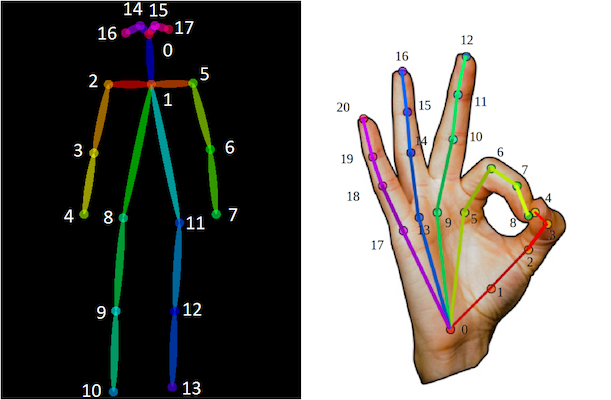
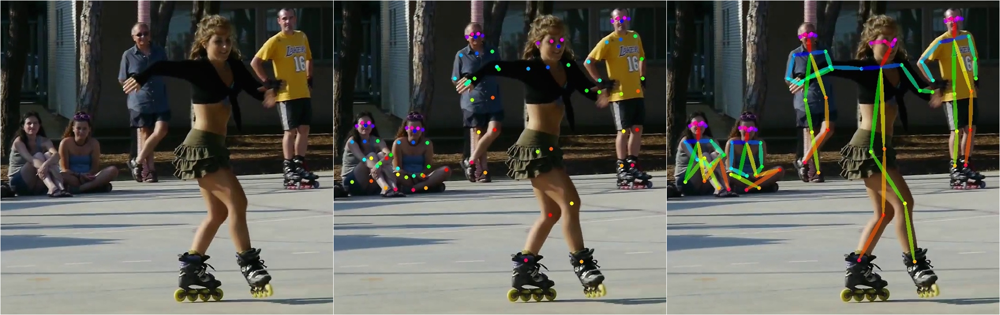

## pytorch-openpose

#### Install Requriements

Create a python 3.7 environement, eg:

    conda create -n pytorch-openpose python=3.7
    conda activate pytorch-openpose

Install pytorch by following the quick start guide here (use pip) https://download.pytorch.org/whl/torch_stable.html

Install other requirements with pip

    pip install -r requirements.txt

#### Run the Demo

Run:

    python demo_camera.py

to run a demo with a feed from your webcam or run

    python demo.py

to use a image from the images folder or run 

    python demo_video.py <video-file>

to process a video file (requires [ffmpeg-python][ffmpeg]).

[ffmpeg]: https://pypi.org/project/ffmpeg-python/

### Todo list
- [x] convert caffemodel to pytorch.
- [x] Body Pose Estimation.
- [x] Hand Pose Estimation.
- [ ] Performance test.
- [ ] Speed up.

### Demo
#### Skeleton

#### Body Pose Estimation

pytorch implementation of [openpose](https://github.com/CMU-Perceptual-Computing-Lab/openpose) including **Body and Hand Pose Estimation**, and the pytorch model is directly converted from [openpose](https://github.com/CMU-Perceptual-Computing-Lab/openpose) caffemodel by [caffemodel2pytorch](https://github.com/vadimkantorov/caffemodel2pytorch). 
